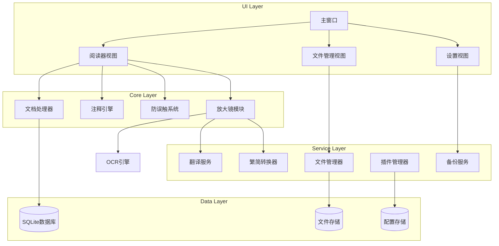

# Design Document: 华为平板PDF阅读器

## Overview

本设计文档描述华为平板PDF阅读器的技术架构和实现方案。该应用的**核心定位是阅读和笔记**，让用户能够舒适地阅读PDF/Word文档并使用华为手写笔做阅读笔记。放大镜工具作为辅助功能，帮助用户查阅不懂的内容（翻译、繁简转换）。

系统采用Python + Kivy框架开发，以支持跨平台部署并针对华为平板进行优化。采用模块化架构，核心功能与插件系统分离，便于后续扩展。

### 核心功能优先级

1. **阅读体验** - 流畅的PDF/Word文档渲染和翻页
2. **笔记功能** - 华为手写笔注释、防误触、多种笔工具
3. **文件管理** - 文档库组织、搜索、标签
4. **辅助查阅** - 放大镜工具（集成翻译、繁简转换）
5. **扩展能力** - 插件系统、云备份

### 技术选型

- **开发语言**: Python 3.10+
- **UI框架**: Kivy 2.2+ (支持Android/HarmonyOS)
- **PDF渲染**: PyMuPDF (fitz)
- **Word处理**: python-docx
- **繁简转换**: OpenCC
- **翻译服务**: 百度翻译API / 有道翻译API
- **OCR识别**: PaddleOCR (轻量级)
- **数据存储**: SQLite + JSON配置文件
- **打包工具**: Buildozer (Android APK)

### 设计原则

1. **模块化**: 各功能模块独立，通过接口通信
2. **可扩展**: 插件系统支持动态加载新功能
3. **响应式**: 针对平板触控和手写笔优化
4. **离线优先**: 核心功能离线可用，翻译等联网功能可选

## Architecture



## Components and Interfaces

### 1. DocumentProcessor (文档处理器)

负责PDF和Word文档的加载、解析和渲染。

```python
from abc import ABC, abstractmethod
from pathlib import Path
from typing import Optional, List, Tuple
from dataclasses import dataclass

@dataclass
class PageInfo:
    """页面信息"""
    page_number: int
    width: float
    height: float
    rotation: int

@dataclass
class DocumentInfo:
    """文档信息"""
    path: Path
    title: str
    total_pages: int
    file_type: str  # 'pdf' or 'docx'
    
class IDocumentRenderer(ABC):
    """文档渲染器接口"""
    
    @abstractmethod
    def open(self, path: Path) -> DocumentInfo:
        """打开文档"""
        pass
    
    @abstractmethod
    def close(self) -> None:
        """关闭文档"""
        pass
    
    @abstractmethod
    def render_page(self, page_num: int, scale: float = 1.0) -> bytes:
        """渲染指定页面，返回图像数据"""
        pass
    
    @abstractmethod
    def get_page_info(self, page_num: int) -> PageInfo:
        """获取页面信息"""
        pass
    
    @abstractmethod
    def extract_text(self, page_num: int, rect: Optional[Tuple[float, float, float, float]] = None) -> str:
        """提取页面文本，可指定区域"""
        pass
    
    @abstractmethod
    def rotate_page(self, page_num: int, angle: int) -> None:
        """旋转页面"""
        pass
    
    @abstractmethod
    def delete_page(self, page_num: int) -> None:
        """删除页面"""
        pass
    
    @abstractmethod
    def export_page_as_image(self, page_num: int, output_path: Path) -> None:
        """导出页面为图片"""
        pass

class PDFRenderer(IDocumentRenderer):
    """PDF渲染器实现"""
    pass

class WordRenderer(IDocumentRenderer):
    """Word文档渲染器实现（转换为PDF后渲染）"""
    pass
```

### 2. AnnotationEngine (注释引擎)

处理手写笔输入和注释管理。

```python
from enum import Enum
from dataclasses import dataclass, field
from typing import List, Tuple
from datetime import datetime

class PenType(Enum):
    """笔类型"""
    BALLPOINT = "ballpoint"      # 圆珠笔
    FOUNTAIN = "fountain"        # 钢笔
    HIGHLIGHTER = "highlighter"  # 荧光笔
    PENCIL = "pencil"           # 铅笔
    MARKER = "marker"           # 马克笔

@dataclass
class StrokePoint:
    """笔画点"""
    x: float
    y: float
    pressure: float  # 0.0 - 1.0
    timestamp: float

@dataclass
class Stroke:
    """笔画"""
    id: str
    pen_type: PenType
    color: str  # hex color
    width: float
    points: List[StrokePoint] = field(default_factory=list)

@dataclass
class Annotation:
    """注释"""
    id: str
    page_num: int
    strokes: List[Stroke] = field(default_factory=list)
    created_at: datetime = field(default_factory=datetime.now)
    modified_at: datetime = field(default_factory=datetime.now)

class IAnnotationEngine(ABC):
    """注释引擎接口"""
    
    @abstractmethod
    def start_stroke(self, pen_type: PenType, color: str, width: float) -> str:
        """开始新笔画，返回笔画ID"""
        pass
    
    @abstractmethod
    def add_point(self, stroke_id: str, x: float, y: float, pressure: float) -> None:
        """添加笔画点"""
        pass
    
    @abstractmethod
    def end_stroke(self, stroke_id: str) -> Stroke:
        """结束笔画"""
        pass
    
    @abstractmethod
    def erase_at(self, page_num: int, x: float, y: float, radius: float) -> List[str]:
        """擦除指定位置的笔画，返回被删除的笔画ID列表"""
        pass
    
    @abstractmethod
    def get_annotations(self, page_num: int) -> List[Annotation]:
        """获取页面注释"""
        pass
    
    @abstractmethod
    def save_annotations(self, doc_id: str) -> None:
        """保存注释"""
        pass
    
    @abstractmethod
    def load_annotations(self, doc_id: str) -> None:
        """加载注释"""
        pass
    
    @abstractmethod
    def shape_recognition(self, stroke: Stroke) -> Optional[Stroke]:
        """一笔成型：识别并转换为标准图形"""
        pass
```

### 3. PalmRejectionSystem (防误触系统)

区分手掌和笔尖输入。

```python
from enum import Enum
from dataclasses import dataclass
from typing import List, Optional

class TouchType(Enum):
    """触摸类型"""
    STYLUS = "stylus"      # 手写笔
    FINGER = "finger"      # 手指
    PALM = "palm"          # 手掌
    UNKNOWN = "unknown"

@dataclass
class TouchEvent:
    """触摸事件"""
    id: int
    x: float
    y: float
    pressure: float
    size: float  # 触摸面积
    touch_type: TouchType
    timestamp: float

class IPalmRejectionSystem(ABC):
    """防误触系统接口"""
    
    @abstractmethod
    def classify_touch(self, event: TouchEvent) -> TouchType:
        """分类触摸类型"""
        pass
    
    @abstractmethod
    def should_reject(self, event: TouchEvent) -> bool:
        """判断是否应该拒绝该触摸"""
        pass
    
    @abstractmethod
    def set_sensitivity(self, level: int) -> None:
        """设置灵敏度 (1-10)"""
        pass
    
    @abstractmethod
    def on_stylus_hover(self, is_hovering: bool) -> None:
        """手写笔悬停状态变化"""
        pass
```

### 4. Magnifier (放大镜模块)

放大镜是**辅助查阅工具**，帮助用户在阅读过程中查看不懂的内容。集成了放大、区域选择、翻译（英汉/汉英）和繁简转换功能。用户通过放大镜选择文档区域后，可以直接进行翻译或繁简转换操作。

```python
from enum import Enum

class MagnifierAction(Enum):
    """放大镜操作类型"""
    MAGNIFY = "magnify"              # 仅放大
    TRANSLATE_EN_ZH = "translate_en_zh"  # 英译汉
    TRANSLATE_ZH_EN = "translate_zh_en"  # 汉译英
    CONVERT_T2S = "convert_t2s"      # 繁转简
    CONVERT_S2T = "convert_s2t"      # 简转繁

@dataclass
class MagnifierConfig:
    """放大镜配置"""
    size: Tuple[int, int] = (200, 200)  # 放大镜尺寸
    zoom_level: float = 2.0              # 放大倍数
    shape: str = "circle"                # 形状: circle/rectangle

@dataclass
class MagnifierResult:
    """放大镜操作结果"""
    action: MagnifierAction
    original_text: str
    result_text: str
    success: bool
    error_message: Optional[str] = None
    region: Optional[Tuple[float, float, float, float]] = None

class IMagnifier(ABC):
    """放大镜接口 - 集成放大、翻译、繁简转换功能"""
    
    @abstractmethod
    def activate(self, config: MagnifierConfig) -> None:
        """激活放大镜"""
        pass
    
    @abstractmethod
    def deactivate(self) -> None:
        """关闭放大镜"""
        pass
    
    @abstractmethod
    def move_to(self, x: float, y: float) -> None:
        """移动放大镜位置"""
        pass
    
    @abstractmethod
    def get_magnified_region(self) -> bytes:
        """获取放大区域图像"""
        pass
    
    @abstractmethod
    def select_region(self, x1: float, y1: float, x2: float, y2: float) -> Tuple[float, float, float, float]:
        """选择区域，返回文档坐标"""
        pass
    
    @abstractmethod
    def extract_text_from_region(self, region: Tuple[float, float, float, float]) -> str:
        """从选中区域提取文字（OCR）"""
        pass
    
    @abstractmethod
    def perform_action(self, action: MagnifierAction, region: Tuple[float, float, float, float]) -> MagnifierResult:
        """
        在选中区域执行操作（翻译或繁简转换）
        
        流程:
        1. 从区域提取文字（OCR）
        2. 根据action类型调用对应服务（翻译/转换）
        3. 返回结果供UI显示
        """
        pass
    
    @abstractmethod
    def get_available_actions(self) -> List[MagnifierAction]:
        """获取当前可用的操作列表"""
        pass

class Magnifier(IMagnifier):
    """放大镜实现 - 整合翻译和繁简转换服务"""
    
    def __init__(self, 
                 translation_service: ITranslationService,
                 chinese_converter: IChineseConverter,
                 ocr_engine: 'IOCREngine'):
        self._translation = translation_service
        self._converter = chinese_converter
        self._ocr = ocr_engine
        self._config: Optional[MagnifierConfig] = None
        self._current_region: Optional[Tuple[float, float, float, float]] = None
    
    def perform_action(self, action: MagnifierAction, region: Tuple[float, float, float, float]) -> MagnifierResult:
        """执行放大镜操作"""
        # 1. OCR提取文字
        text = self.extract_text_from_region(region)
        if not text:
            return MagnifierResult(
                action=action,
                original_text="",
                result_text="",
                success=False,
                error_message="无法识别文字",
                region=region
            )
        
        # 2. 根据操作类型处理
        result_text = ""
        error_msg = None
        success = True
        
        try:
            if action == MagnifierAction.TRANSLATE_EN_ZH:
                result = self._translation.translate(text, TranslationDirection.EN_TO_ZH)
                result_text = result.translated
                success = result.success
                error_msg = result.error_message
            elif action == MagnifierAction.TRANSLATE_ZH_EN:
                result = self._translation.translate(text, TranslationDirection.ZH_TO_EN)
                result_text = result.translated
                success = result.success
                error_msg = result.error_message
            elif action == MagnifierAction.CONVERT_T2S:
                result_text = self._converter.convert(text, ConversionDirection.TRADITIONAL_TO_SIMPLIFIED)
            elif action == MagnifierAction.CONVERT_S2T:
                result_text = self._converter.convert(text, ConversionDirection.SIMPLIFIED_TO_TRADITIONAL)
            else:
                result_text = text  # MAGNIFY模式直接返回原文
        except Exception as e:
            success = False
            error_msg = str(e)
        
        return MagnifierResult(
            action=action,
            original_text=text,
            result_text=result_text,
            success=success,
            error_message=error_msg,
            region=region
        )
```

### 5. TranslationService (翻译服务)

```python
class TranslationDirection(Enum):
    """翻译方向"""
    EN_TO_ZH = "en_to_zh"  # 英译汉
    ZH_TO_EN = "zh_to_en"  # 汉译英

@dataclass
class TranslationResult:
    """翻译结果"""
    original: str
    translated: str
    direction: TranslationDirection
    success: bool
    error_message: Optional[str] = None

class ITranslationService(ABC):
    """翻译服务接口"""
    
    @abstractmethod
    def translate(self, text: str, direction: TranslationDirection) -> TranslationResult:
        """翻译文本"""
        pass
    
    @abstractmethod
    def is_available(self) -> bool:
        """检查服务是否可用"""
        pass
```

### 6. ChineseConverter (繁简转换器)

```python
class ConversionDirection(Enum):
    """转换方向"""
    TRADITIONAL_TO_SIMPLIFIED = "t2s"  # 繁转简
    SIMPLIFIED_TO_TRADITIONAL = "s2t"  # 简转繁

class IChineseConverter(ABC):
    """中文转换器接口"""
    
    @abstractmethod
    def convert(self, text: str, direction: ConversionDirection) -> str:
        """转换文本"""
        pass
    
    @abstractmethod
    def is_traditional(self, char: str) -> bool:
        """判断是否为繁体字"""
        pass
```

### 7. PluginManager (插件管理器)

```python
@dataclass
class PluginInfo:
    """插件信息"""
    id: str
    name: str
    version: str
    author: str
    description: str
    entry_point: str
    permissions: List[str]
    enabled: bool = False

class IPlugin(ABC):
    """插件基类"""
    
    @abstractmethod
    def on_load(self, api: 'PluginAPI') -> None:
        """插件加载时调用"""
        pass
    
    @abstractmethod
    def on_unload(self) -> None:
        """插件卸载时调用"""
        pass
    
    @property
    @abstractmethod
    def info(self) -> PluginInfo:
        """获取插件信息"""
        pass

class IPluginManager(ABC):
    """插件管理器接口"""
    
    @abstractmethod
    def install_plugin(self, plugin_path: Path) -> PluginInfo:
        """安装插件"""
        pass
    
    @abstractmethod
    def uninstall_plugin(self, plugin_id: str) -> None:
        """卸载插件"""
        pass
    
    @abstractmethod
    def enable_plugin(self, plugin_id: str) -> None:
        """启用插件"""
        pass
    
    @abstractmethod
    def disable_plugin(self, plugin_id: str) -> None:
        """禁用插件"""
        pass
    
    @abstractmethod
    def get_installed_plugins(self) -> List[PluginInfo]:
        """获取已安装插件列表"""
        pass
    
    @abstractmethod
    def validate_plugin(self, plugin_path: Path) -> Tuple[bool, str]:
        """验证插件，返回(是否有效, 错误信息)"""
        pass
```

### 8. FileManager (文件管理器)

```python
@dataclass
class DocumentEntry:
    """文档条目"""
    id: str
    path: Path
    title: str
    thumbnail: Optional[bytes]
    file_type: str
    size: int
    created_at: datetime
    modified_at: datetime
    folder_id: Optional[str]
    tags: List[str] = field(default_factory=list)

@dataclass
class Folder:
    """文件夹"""
    id: str
    name: str
    parent_id: Optional[str]
    created_at: datetime

class IFileManager(ABC):
    """文件管理器接口"""
    
    @abstractmethod
    def get_documents(self, folder_id: Optional[str] = None, tag: Optional[str] = None) -> List[DocumentEntry]:
        """获取文档列表"""
        pass
    
    @abstractmethod
    def search_documents(self, keyword: str) -> List[DocumentEntry]:
        """搜索文档"""
        pass
    
    @abstractmethod
    def create_folder(self, name: str, parent_id: Optional[str] = None) -> Folder:
        """创建文件夹"""
        pass
    
    @abstractmethod
    def delete_document(self, doc_id: str) -> None:
        """删除文档（移至回收站）"""
        pass
    
    @abstractmethod
    def add_tag(self, doc_id: str, tag: str) -> None:
        """添加标签"""
        pass
    
    @abstractmethod
    def remove_tag(self, doc_id: str, tag: str) -> None:
        """移除标签"""
        pass
    
    @abstractmethod
    def generate_thumbnail(self, doc_path: Path) -> bytes:
        """生成文档缩略图"""
        pass
```

### 9. BackupService (备份服务)

```python
class BackupProvider(Enum):
    """备份提供商"""
    LOCAL = "local"
    BAIDU_PAN = "baidu_pan"
    ONEDRIVE = "onedrive"

@dataclass
class BackupConfig:
    """备份配置"""
    provider: BackupProvider
    auto_backup: bool = False
    wifi_only: bool = True
    backup_path: Optional[str] = None

class IBackupService(ABC):
    """备份服务接口"""
    
    @abstractmethod
    def backup(self, provider: BackupProvider) -> bool:
        """执行备份"""
        pass
    
    @abstractmethod
    def restore(self, provider: BackupProvider) -> bool:
        """恢复备份"""
        pass
    
    @abstractmethod
    def bind_account(self, provider: BackupProvider, credentials: dict) -> bool:
        """绑定云账号"""
        pass
    
    @abstractmethod
    def unbind_account(self, provider: BackupProvider) -> None:
        """解绑云账号"""
        pass
    
    @abstractmethod
    def set_config(self, config: BackupConfig) -> None:
        """设置备份配置"""
        pass
```

## Data Models

### SQLite数据库Schema

```sql
-- 文档表
CREATE TABLE documents (
    id TEXT PRIMARY KEY,
    path TEXT NOT NULL,
    title TEXT NOT NULL,
    file_type TEXT NOT NULL,
    size INTEGER NOT NULL,
    folder_id TEXT,
    thumbnail BLOB,
    created_at TIMESTAMP DEFAULT CURRENT_TIMESTAMP,
    modified_at TIMESTAMP DEFAULT CURRENT_TIMESTAMP,
    is_deleted INTEGER DEFAULT 0,
    FOREIGN KEY (folder_id) REFERENCES folders(id)
);

-- 文件夹表
CREATE TABLE folders (
    id TEXT PRIMARY KEY,
    name TEXT NOT NULL,
    parent_id TEXT,
    created_at TIMESTAMP DEFAULT CURRENT_TIMESTAMP,
    FOREIGN KEY (parent_id) REFERENCES folders(id)
);

-- 标签表
CREATE TABLE tags (
    id TEXT PRIMARY KEY,
    name TEXT NOT NULL UNIQUE,
    color TEXT DEFAULT '#808080'
);

-- 文档标签关联表
CREATE TABLE document_tags (
    document_id TEXT NOT NULL,
    tag_id TEXT NOT NULL,
    PRIMARY KEY (document_id, tag_id),
    FOREIGN KEY (document_id) REFERENCES documents(id),
    FOREIGN KEY (tag_id) REFERENCES tags(id)
);

-- 注释表
CREATE TABLE annotations (
    id TEXT PRIMARY KEY,
    document_id TEXT NOT NULL,
    page_num INTEGER NOT NULL,
    data BLOB NOT NULL,  -- JSON序列化的注释数据
    created_at TIMESTAMP DEFAULT CURRENT_TIMESTAMP,
    modified_at TIMESTAMP DEFAULT CURRENT_TIMESTAMP,
    FOREIGN KEY (document_id) REFERENCES documents(id)
);

-- 书签表
CREATE TABLE bookmarks (
    id TEXT PRIMARY KEY,
    document_id TEXT NOT NULL,
    page_num INTEGER NOT NULL,
    title TEXT NOT NULL,
    created_at TIMESTAMP DEFAULT CURRENT_TIMESTAMP,
    FOREIGN KEY (document_id) REFERENCES documents(id)
);

-- 插件表
CREATE TABLE plugins (
    id TEXT PRIMARY KEY,
    name TEXT NOT NULL,
    version TEXT NOT NULL,
    author TEXT,
    description TEXT,
    entry_point TEXT NOT NULL,
    permissions TEXT,  -- JSON数组
    enabled INTEGER DEFAULT 0,
    installed_at TIMESTAMP DEFAULT CURRENT_TIMESTAMP
);

-- 设置表
CREATE TABLE settings (
    key TEXT PRIMARY KEY,
    value TEXT NOT NULL
);
```

### 配置文件结构 (config.json)

```json
{
  "theme": "dark_green",
  "language": "zh_CN",
  "reading": {
    "page_direction": "vertical",
    "dual_page": false,
    "continuous_scroll": true,
    "toolbar_position": "top",
    "eye_protection": false,
    "keep_screen_on": true
  },
  "stylus": {
    "double_tap": "eraser",
    "long_press": "select_text",
    "primary_click": "none",
    "secondary_click": "undo",
    "pinch": "none",
    "swipe_up": "none",
    "swipe_down": "none",
    "palm_rejection_sensitivity": 7
  },
  "tools": {
    "shape_recognition": true,
    "pressure_sensitivity": true,
    "shape_fill": false,
    "long_press_select_text": true,
    "long_press_create_menu": true
  },
  "backup": {
    "provider": "local",
    "auto_backup": false,
    "wifi_only": true
  },
  "translation": {
    "default_direction": "en_to_zh",
    "api_provider": "baidu"
  }
}
```


## Correctness Properties

*A property is a characteristic or behavior that should hold true across all valid executions of a system-essentially, a formal statement about what the system should do. Properties serve as the bridge between human-readable specifications and machine-verifiable correctness guarantees.*

### Property 1: 文档打开一致性

*For any* 有效的PDF或Word文档路径，打开文档后返回的DocumentInfo应包含正确的文件类型、非零页数和有效的文档标题。

**Validates: Requirements 1.1, 1.2, 1.3**

### Property 2: 无效文档错误处理

*For any* 无效的文件路径或损坏的文档，Document_Processor应返回错误而不是崩溃，且错误信息应非空。

**Validates: Requirements 1.6**

### Property 3: 文档搜索相关性

*For any* 文档集合和搜索关键词，搜索结果中的每个文档的标题或路径应包含该关键词（不区分大小写）。

**Validates: Requirements 2.4**

### Property 4: 文档条目完整性

*For any* 文档条目，应包含非空的缩略图数据和有效的修改日期。

**Validates: Requirements 2.6**

### Property 5: 笔画设置应用

*For any* 笔类型、颜色和粗细设置，创建的笔画应使用这些设置值。

**Validates: Requirements 3.2, 3.3**

### Property 6: 橡皮擦功能

*For any* 包含笔画的页面，在笔画位置使用橡皮擦后，该笔画应从页面注释中移除。

**Validates: Requirements 3.4**

### Property 7: 注释保存往返一致性

*For any* 有效的注释数据，保存后再加载应产生等效的注释数据。

**Validates: Requirements 3.5**

### Property 8: 压感笔迹粗细

*For any* 两个不同压力值的笔画点（在相同笔设置下），压力值较大的点应产生较粗的笔迹。

**Validates: Requirements 3.6**

### Property 9: 触摸类型分类

*For any* 触摸事件，Palm_Rejection_System应将其分类为STYLUS、FINGER或PALM之一。大面积低压力的触摸应被分类为PALM，小面积高压力的触摸应被分类为STYLUS。

**Validates: Requirements 4.1, 4.2, 4.4**

### Property 10: 防误触灵敏度

*For any* 灵敏度设置（1-10），较高的灵敏度应导致更多的触摸被分类为PALM。

**Validates: Requirements 4.3**

### Property 11: 手写笔悬停状态

*For any* 手写笔悬停状态变化，当悬停为true时防误触模式应启用，当悬停为false时应根据设置决定。

**Validates: Requirements 4.5**

### Property 12: 繁简转换正确性

*For any* 包含繁体中文的文本，转换后的文本长度应与原文本相同，且所有繁体字符应被转换为对应的简体字符。

**Validates: Requirements 6.1, 6.2**

### Property 13: 繁简转换不变性

*For any* 包含非中文字符（英文、数字、标点）的文本，这些字符在转换后应保持不变。

**Validates: Requirements 6.4**

### Property 14: 繁简转换往返一致性

*For any* 有效的简体中文文本，转换为繁体再转换回简体应产生等效的原始文本。

**Validates: Requirements 6.5**

### Property 15: 插件验证

*For any* 插件文件，验证函数应返回(bool, str)元组，其中bool表示是否有效，str为错误信息（有效时为空）。

**Validates: Requirements 7.1**

### Property 16: 插件生命周期

*For any* 有效的插件，安装→启用→禁用→卸载的生命周期应正确更新插件状态，且每个状态转换后get_installed_plugins应反映正确的状态。

**Validates: Requirements 7.2, 7.3, 7.4**

### Property 17: 插件错误隔离

*For any* 执行时抛出异常的插件，Plugin_Manager应捕获异常并返回错误信息，主程序应继续正常运行。

**Validates: Requirements 7.6**

### Property 18: 插件自动加载

*For any* 已启用的插件集合，应用启动后这些插件应全部处于已加载状态。

**Validates: Requirements 7.7**

### Property 19: 页面旋转

*For any* 页面和旋转角度（90、180、270），旋转后页面的rotation属性应更新为新角度。

**Validates: Requirements 9.3**

### Property 20: 页面删除

*For any* 多页文档，删除一页后文档总页数应减少1。

**Validates: Requirements 9.4**

### Property 21: 页面跳转

*For any* 有效的页码（1到总页数），跳转后当前页码应等于目标页码。

**Validates: Requirements 9.5**

### Property 22: 书签添加

*For any* 页面位置和书签标题，添加书签后该书签应出现在文档的书签列表中。

**Validates: Requirements 9.6**

### Property 23: 配置往返一致性

*For any* 有效的配置对象，序列化为JSON后再反序列化应产生等效的配置对象。

**Validates: Requirements 10.1-10.7**

### Property 24: 本地备份往返一致性

*For any* 文档和注释数据，本地备份后再恢复应产生等效的数据。

**Validates: Requirements 11.1**

## Error Handling

### 文档处理错误

| 错误类型 | 处理方式 | 用户提示 |
|---------|---------|---------|
| 文件不存在 | 返回FileNotFoundError | "文件不存在，请检查路径" |
| 格式不支持 | 返回UnsupportedFormatError | "不支持的文件格式" |
| 文件损坏 | 返回CorruptedFileError | "文件已损坏，无法打开" |
| 权限不足 | 返回PermissionError | "没有权限访问该文件" |

### 注释引擎错误

| 错误类型 | 处理方式 | 用户提示 |
|---------|---------|---------|
| 保存失败 | 重试3次后提示 | "注释保存失败，请重试" |
| 加载失败 | 使用空注释 | "注释加载失败，将使用空白注释" |

### 翻译服务错误

| 错误类型 | 处理方式 | 用户提示 |
|---------|---------|---------|
| 网络不可用 | 返回离线错误 | "网络不可用，请检查连接" |
| API限流 | 延迟重试 | "请求过于频繁，请稍后重试" |
| 翻译失败 | 返回原文 | "翻译失败，请重试" |

### 插件错误

| 错误类型 | 处理方式 | 用户提示 |
|---------|---------|---------|
| 验证失败 | 拒绝安装 | "插件验证失败：{原因}" |
| 加载失败 | 禁用插件 | "插件加载失败，已自动禁用" |
| 运行时错误 | 隔离并记录 | "插件运行出错，已隔离" |

## Testing Strategy

### 测试框架

- **单元测试**: pytest
- **属性测试**: hypothesis
- **UI测试**: pytest-kivy (可选)
- **覆盖率**: pytest-cov

### 测试分层

```
tests/
├── unit/                    # 单元测试
│   ├── test_document_processor.py
│   ├── test_annotation_engine.py
│   ├── test_palm_rejection.py
│   ├── test_chinese_converter.py
│   ├── test_plugin_manager.py
│   └── test_file_manager.py
├── property/                # 属性测试
│   ├── test_document_properties.py
│   ├── test_annotation_properties.py
│   ├── test_palm_rejection_properties.py
│   ├── test_converter_properties.py
│   ├── test_plugin_properties.py
│   └── test_config_properties.py
└── integration/             # 集成测试
    ├── test_reader_flow.py
    └── test_annotation_flow.py
```

### 属性测试配置

```python
from hypothesis import settings, Verbosity

# 每个属性测试至少运行100次
settings.register_profile("default", max_examples=100)
settings.register_profile("ci", max_examples=200)
settings.load_profile("default")
```

### 测试标注格式

每个属性测试必须包含以下注释：

```python
# Feature: huawei-pdf-reader, Property N: {property_text}
# Validates: Requirements X.Y
```

### 单元测试与属性测试的分工

- **单元测试**: 验证特定示例、边界条件、错误处理
- **属性测试**: 验证跨所有输入的通用属性

两者互补，共同提供全面的测试覆盖。
