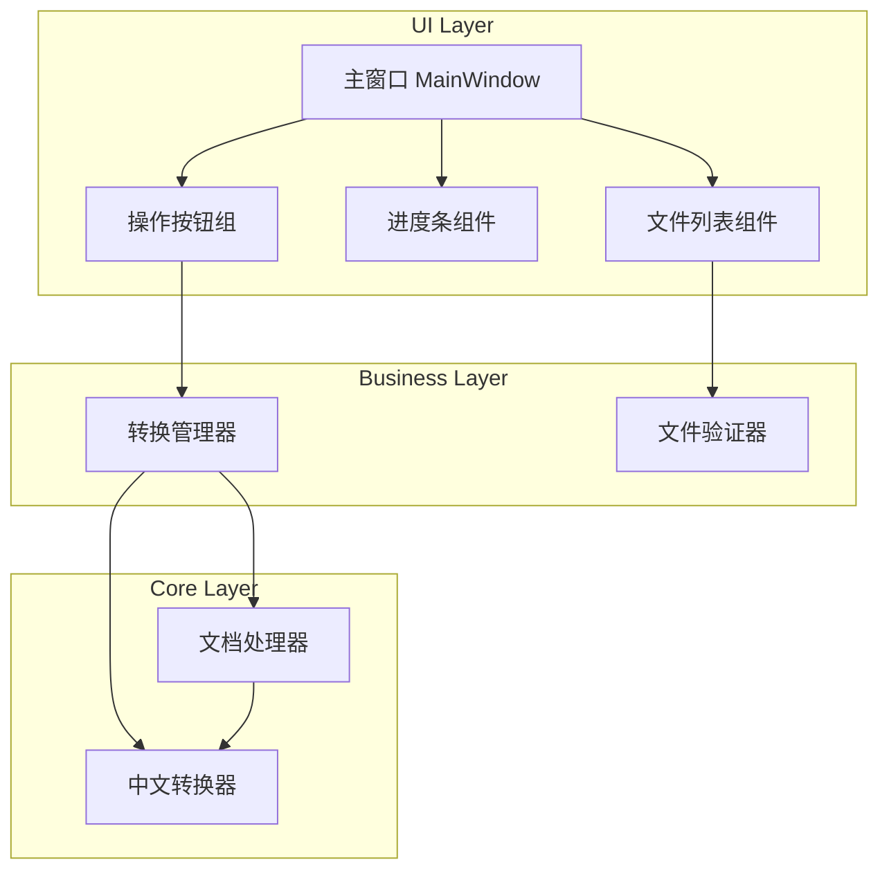

# Design Document

## Overview

本设计文档描述了一个桌面应用程序，用于将Word文档中的繁体中文转换为简体中文。应用采用Python开发，使用python-docx库处理Word文档，OpenCC库进行繁简转换，PyQt6构建现代化GUI界面。

## Architecture



## Components and Interfaces

### 1. ChineseConverter (中文转换器)

负责繁体到简体的文字转换。

```python
class ChineseConverter:
    """繁体转简体转换器"""
    
    def __init__(self):
        """初始化OpenCC转换器"""
        pass
    
    def convert(self, text: str) -> str:
        """
        将繁体中文转换为简体中文
        
        Args:
            text: 待转换的文本
            
        Returns:
            转换后的简体中文文本
        """
        pass
    
    def is_traditional(self, char: str) -> bool:
        """
        判断字符是否为繁体字
        
        Args:
            char: 单个字符
            
        Returns:
            是否为繁体字
        """
        pass
```

### 2. DocumentProcessor (文档处理器)

负责读取和写入Word文档，保留格式和非文本元素。

```python
from pathlib import Path
from typing import Callable, Optional

class DocumentProcessor:
    """Word文档处理器"""
    
    def __init__(self, converter: ChineseConverter):
        """
        初始化文档处理器
        
        Args:
            converter: 中文转换器实例
        """
        pass
    
    def process_document(
        self, 
        input_path: Path, 
        output_path: Path,
        progress_callback: Optional[Callable[[int], None]] = None
    ) -> ProcessResult:
        """
        处理单个Word文档
        
        Args:
            input_path: 输入文件路径
            output_path: 输出文件路径
            progress_callback: 进度回调函数
            
        Returns:
            处理结果对象
        """
        pass
    
    def _process_paragraph(self, paragraph) -> int:
        """
        处理单个段落，保留格式
        
        Args:
            paragraph: python-docx段落对象
            
        Returns:
            转换的字符数
        """
        pass
    
    def _process_table(self, table) -> int:
        """
        处理表格中的文本
        
        Args:
            table: python-docx表格对象
            
        Returns:
            转换的字符数
        """
        pass
```

### 3. ConversionManager (转换管理器)

协调文件处理流程，管理批量转换任务。

```python
from pathlib import Path
from typing import List, Callable
from dataclasses import dataclass

@dataclass
class ConversionTask:
    """转换任务"""
    input_path: Path
    output_path: Path
    status: str = "pending"  # pending, processing, completed, failed
    error_message: str = ""
    converted_chars: int = 0

@dataclass
class ProcessResult:
    """处理结果"""
    success: bool
    converted_chars: int
    error_message: str = ""

class ConversionManager:
    """转换管理器"""
    
    def __init__(self):
        """初始化转换管理器"""
        pass
    
    def add_files(self, file_paths: List[Path]) -> List[Path]:
        """
        添加文件到转换队列
        
        Args:
            file_paths: 文件路径列表
            
        Returns:
            成功添加的文件路径列表（排除重复）
        """
        pass
    
    def remove_file(self, file_path: Path) -> bool:
        """
        从队列中移除文件
        
        Args:
            file_path: 文件路径
            
        Returns:
            是否成功移除
        """
        pass
    
    def clear_files(self) -> None:
        """清空文件队列"""
        pass
    
    def start_conversion(
        self,
        output_dir: Optional[Path] = None,
        progress_callback: Optional[Callable[[int, int, str], None]] = None,
        completion_callback: Optional[Callable[[List[ConversionTask]], None]] = None
    ) -> None:
        """
        开始批量转换
        
        Args:
            output_dir: 输出目录，None则保存到原文件目录
            progress_callback: 进度回调(当前文件索引, 总文件数, 当前文件名)
            completion_callback: 完成回调(任务列表)
        """
        pass
    
    def get_default_output_path(self, input_path: Path) -> Path:
        """
        获取默认输出路径
        
        Args:
            input_path: 输入文件路径
            
        Returns:
            添加"_简体"后缀的输出路径
        """
        pass
```

### 4. FileValidator (文件验证器)

验证文件格式和可访问性。

```python
from pathlib import Path
from typing import Tuple

class FileValidator:
    """文件验证器"""
    
    SUPPORTED_EXTENSIONS = {'.docx', '.doc'}
    
    @staticmethod
    def validate(file_path: Path) -> Tuple[bool, str]:
        """
        验证文件是否有效
        
        Args:
            file_path: 文件路径
            
        Returns:
            (是否有效, 错误信息)
        """
        pass
    
    @staticmethod
    def is_supported_format(file_path: Path) -> bool:
        """
        检查文件格式是否支持
        
        Args:
            file_path: 文件路径
            
        Returns:
            是否为支持的格式
        """
        pass
```

### 5. MainWindow (主窗口)

PyQt6主窗口，提供用户界面。

```python
from PyQt6.QtWidgets import QMainWindow, QWidget
from PyQt6.QtCore import pyqtSignal

class MainWindow(QMainWindow):
    """主窗口"""
    
    # 信号定义
    files_dropped = pyqtSignal(list)  # 文件拖拽信号
    conversion_requested = pyqtSignal()  # 转换请求信号
    
    def __init__(self):
        """初始化主窗口"""
        pass
    
    def setup_ui(self) -> None:
        """设置UI组件"""
        pass
    
    def setup_styles(self) -> None:
        """设置样式表"""
        pass
    
    def add_files_to_list(self, file_paths: List[Path]) -> None:
        """添加文件到列表显示"""
        pass
    
    def update_progress(self, current: int, total: int, filename: str) -> None:
        """更新进度显示"""
        pass
    
    def show_completion(self, results: List[ConversionTask]) -> None:
        """显示完成信息"""
        pass
    
    def show_error(self, message: str) -> None:
        """显示错误信息"""
        pass
```

## Data Models

### ConversionTask

```python
@dataclass
class ConversionTask:
    """转换任务数据模型"""
    input_path: Path          # 输入文件路径
    output_path: Path         # 输出文件路径
    status: str = "pending"   # 状态: pending, processing, completed, failed
    error_message: str = ""   # 错误信息
    converted_chars: int = 0  # 转换的字符数
```

### ProcessResult

```python
@dataclass
class ProcessResult:
    """处理结果数据模型"""
    success: bool             # 是否成功
    converted_chars: int      # 转换的字符数
    error_message: str = ""   # 错误信息
```

### AppConfig

```python
@dataclass
class AppConfig:
    """应用配置"""
    default_output_suffix: str = "_简体"  # 默认输出文件后缀
    window_width: int = 600               # 窗口宽度
    window_height: int = 400              # 窗口高度
    theme: str = "light"                  # 主题
```


## Correctness Properties

*A property is a characteristic or behavior that should hold true across all valid executions of a system—essentially, a formal statement about what the system should do. Properties serve as the bridge between human-readable specifications and machine-verifiable correctness guarantees.*

### Property 1: 繁简转换正确性

*For any* 繁体中文文本，转换后的文本应该是对应的简体中文，且原有的简体字符保持不变。

**Validates: Requirements 2.1, 2.4**

### Property 2: 文件去重

*For any* 文件列表和任意新文件路径，如果该文件路径已存在于列表中，则添加操作后列表长度不变。

**Validates: Requirements 1.4**

### Property 3: 默认输出路径生成

*For any* 有效的输入文件路径，生成的默认输出路径应该是原目录下的同名文件加上"_简体"后缀，且扩展名为.docx。

**Validates: Requirements 3.3**

### Property 4: 转换幂等性

*For any* 纯简体中文文本，对其进行繁简转换后，结果应该与原文本完全相同（转换是幂等的）。

**Validates: Requirements 2.4**

### Property 5: 文件格式验证

*For any* 文件路径，验证器应该正确识别.docx和.doc文件为有效格式，其他格式为无效。

**Validates: Requirements 1.1**

## Error Handling

### 文件错误

| 错误类型 | 处理方式 |
|---------|---------|
| 文件不存在 | 显示错误提示，从列表中移除该文件 |
| 文件格式不支持 | 拒绝添加，提示用户选择正确格式 |
| 文件被占用 | 提示用户关闭文件后重试 |
| 文件损坏 | 跳过该文件，记录错误，继续处理其他文件 |

### 转换错误

| 错误类型 | 处理方式 |
|---------|---------|
| 内存不足 | 提示用户关闭其他程序或分批处理 |
| 写入失败 | 提示用户检查磁盘空间和权限 |
| 未知错误 | 记录详细日志，显示通用错误信息 |

### 错误恢复策略

1. 批量处理时，单个文件失败不影响其他文件
2. 所有错误都记录到日志文件
3. 提供重试机制

## Testing Strategy

### 单元测试

使用pytest进行单元测试，覆盖以下场景：

1. **ChineseConverter测试**
   - 常见繁体字转换
   - 混合文本转换
   - 空字符串处理
   - 特殊字符处理

2. **FileValidator测试**
   - 有效文件格式验证
   - 无效文件格式拒绝
   - 文件存在性检查

3. **ConversionManager测试**
   - 文件添加和去重
   - 默认输出路径生成
   - 批量转换流程

### 属性测试

使用Hypothesis库进行属性测试，每个属性测试运行至少100次迭代。

1. **Property 1: 繁简转换正确性**
   - 生成随机繁体文本
   - 验证转换结果为简体
   - Tag: **Feature: word-traditional-to-simplified, Property 1: 繁简转换正确性**

2. **Property 2: 文件去重**
   - 生成随机文件路径列表
   - 验证重复添加不改变列表长度
   - Tag: **Feature: word-traditional-to-simplified, Property 2: 文件去重**

3. **Property 3: 默认输出路径生成**
   - 生成随机有效文件路径
   - 验证输出路径格式正确
   - Tag: **Feature: word-traditional-to-simplified, Property 3: 默认输出路径生成**

4. **Property 4: 转换幂等性**
   - 生成随机简体文本
   - 验证转换后与原文相同
   - Tag: **Feature: word-traditional-to-simplified, Property 4: 转换幂等性**

5. **Property 5: 文件格式验证**
   - 生成随机文件扩展名
   - 验证.docx和.doc被接受，其他被拒绝
   - Tag: **Feature: word-traditional-to-simplified, Property 5: 文件格式验证**

### 集成测试

1. 端到端文档转换测试
2. 批量文件处理测试
3. UI交互测试（使用pytest-qt）

### 测试配置

```python
# pytest.ini
[pytest]
testpaths = tests
python_files = test_*.py
python_functions = test_*
addopts = -v --tb=short

# Hypothesis settings
hypothesis_profile = default
```

## 技术选型

| 组件 | 技术 | 说明 |
|-----|-----|-----|
| GUI框架 | PyQt6 | 现代化跨平台GUI框架 |
| Word处理 | python-docx | 读写.docx文件 |
| 繁简转换 | OpenCC | 高质量中文转换库 |
| 测试框架 | pytest + Hypothesis | 单元测试和属性测试 |
| 打包工具 | PyInstaller | 生成独立可执行文件 |

## 依赖项

```
PyQt6>=6.4.0
python-docx>=0.8.11
opencc-python-reimplemented>=0.1.7
pytest>=7.0.0
hypothesis>=6.0.0
pytest-qt>=4.0.0
```
